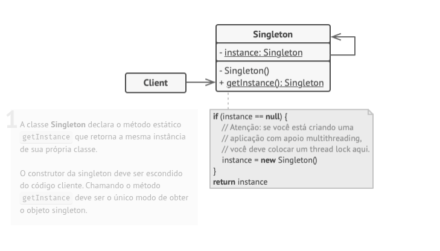
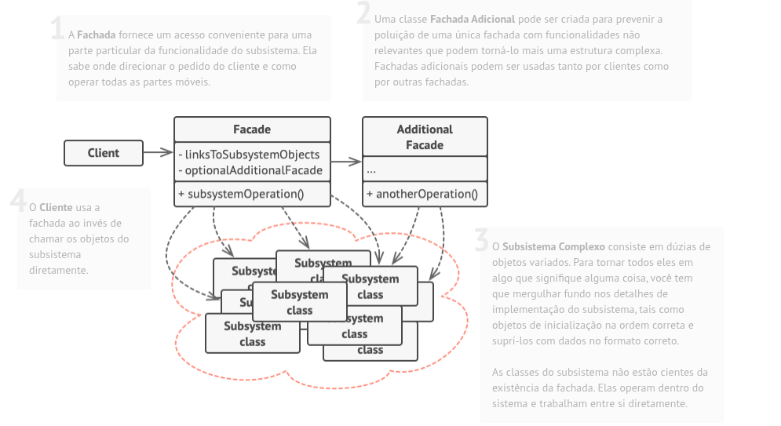

# Design Patterns

| Tecnologias  |
 | :-----------  |
 |Java  |
 |Spring boot |
 |Rest Api |
 |Database h2 |
 |Swagger  |

## Singleton:
O Singleton é um padrão de projeto **criacional** que permite a você garantir que uma classe tenha apenas uma instância, enquanto provê um ponto de acesso global para essa instância.
 
**Todas as implementações do Singleton tem esses dois passos em comum**: 
* Fazer o construtor padrão privado, para prevenir que outros objetos usem o operador new com a classe singleton. 
* Criar um método estático de criação que age como um construtor. Esse método chama o construtor privado por debaixo dos panos para criar um objeto e o salva em um campo estático.  
* Todas as chamadas seguintes para esse método retornam o objeto em cache. 
**Estrutura**

## Strategy:
O Strategy é um padrão de projeto **comportamental** que permite que você defina uma família de algoritmos, coloque-os em classes separadas, e faça os objetos deles intercambiáveis. 
**Aplicabilidade**: 
* Utilize o padrão Strategy quando você quer usar diferentes variantes de um algoritmo dentro de um objeto e ser capaz de trocar de um algoritmo para outro durante a execução. 
* Utilize o Strategy quando você tem muitas classes parecidas que somente diferem na forma que elas executam algum comportamento. 
* Utilize o padrão para isolar a lógica do negócio de uma classe dos detalhes de implementação de algoritmos que podem não ser tão importantes no contexto da lógica. 
* Utilize o padrão quando sua classe tem um operador condicional muito grande que troca entre diferentes variantes do mesmo algoritmo. 
**Estrutura**

## Facade:
O Facade é um padrão de projeto **estrutural** que fornece uma interface simplificada para uma biblioteca, um framework, ou qualquer conjunto complexo de classes. 
**Aplicabilidade**: 
* Utilize o padrão Facade quando você precisa ter uma interface limitada mas simples para um subsistema complexo. 
* Utilize o Facade quando você quer estruturar um subsistema em camadas. 
**Estrutura**

## Spring Framework
Alguns padrões de projetos com Spring: 
* **Singleton**: @Bean e @Autowired 
* **Strategy**: @Service e @Repository 
* **Facade**: Uma API REST
